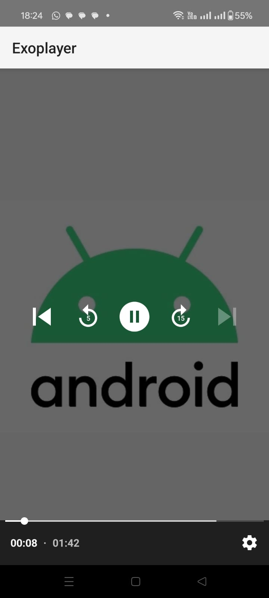
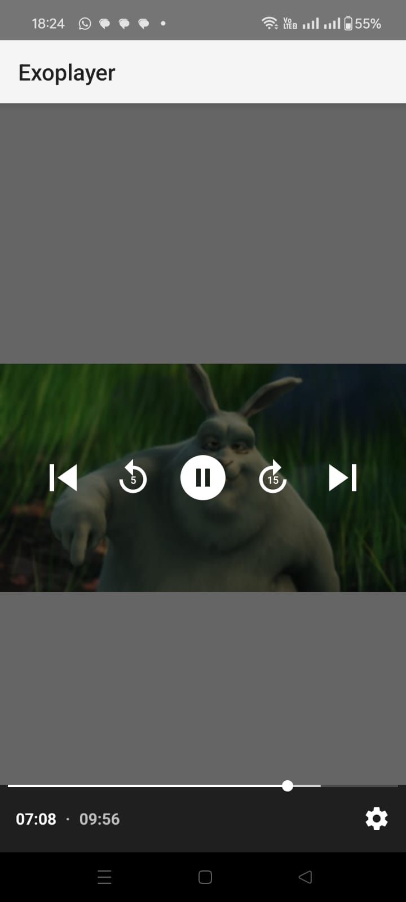

# VideoPlayer

This repository provides a hands-on approach to implementing ExoPlayer in Android applications. The project focuses on setting up ExoPlayer for various use-cases and managing playback states.

## Quick Start
Add the following implementation to your `build.gradle`:

```gradle
implementation("com.google.android.exoplayer:exoplayer:2.19.1")
```

```
Basic Implementation:

val player = ExoPlayer.Builder(context).build()
binding.playerView.player = player
val mediaItem = MediaItem.fromUri("yourURL")
player.setMediaItem(mediaItem)
player.prepare()
player.play()
```

```
Playback States

player.addListener(object : Player.Listener {
    override fun onPlaybackStateChanged(playbackState: Int) {
        when (playbackState) {
            Player.STATE_IDLE -> {}
            Player.STATE_BUFFERING -> {}
            Player.STATE_READY -> {}
            Player.STATE_ENDED -> {}
        }
    }
})
```
Features:
PlayList Management
Changing playback position

   
